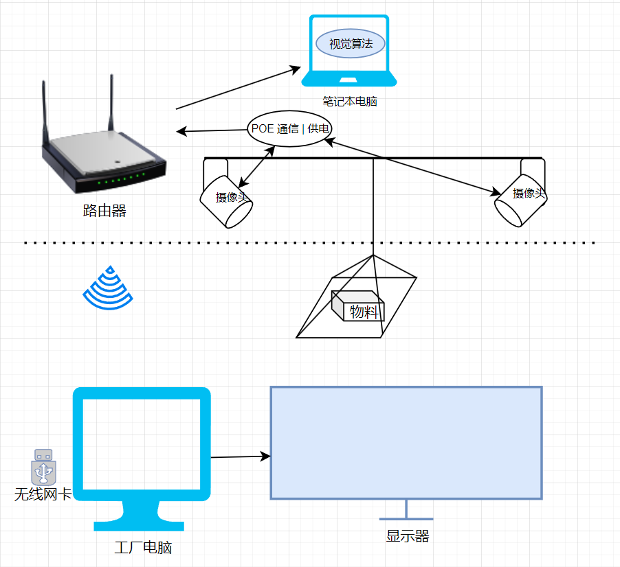

# 天车视觉检测系统
该仓库用于实现 <天车视觉安全检测系统> 的软件方案

-------
硬件布线方式如下图所示

## 软件实现进展
- [x] 基于帧差过滤无效数据
- [x] 根据日期自动创建文件夹保存文件
- [x] 解析图像视频流
- [x] 获取视频流推送局域网浏览器并显示
- [x] 浏览器中显示 "帮助提示"
- [x] 浏览器中获取用户绘制的矩形框作为危险区域
- [x] 多线程多生产者单消费者模型实现
- [x] GPU批推理图片
- [x] 推理结果后处理
- [x] windows下推理模型对接摄像头输入
- [x] 目标检测框显示到浏览器
- [x] 写浏览器画框回调函数
- [x] 解决摄像头安装反的问题
- [x] 添加抽帧，解决浏览器端卡死的问题
- [x] 优化深度学习模型，增加召回率和准确率
- [x] 提交现场测试

## 分辨率确定
原始图像分辨率为 3840 * 2160
宽边设置为640，高边设置为 384保证宽高都是32的整数倍